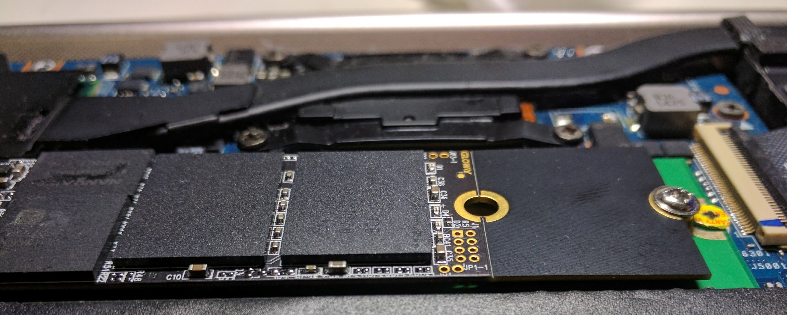

Die Gloway VAL500GS3 ist eine SSD mit M.2-Schnittstelle und dem SM2246EN-Controller.

So wird das Laufwerk für das MP-Tool erkennbar gemacht:

JP1-1-Pins kurzschließen → Laufwerk einschalten → Jumper entfernen → MP-Tool öffnen → Auf „Scan“ klicken → Laufwerk wird erkannt

Für den Rest des Flash-Vorgangs kann eine beliebige allgemeine Anleitung für den SM2246EN-Controller verwendet werden.
