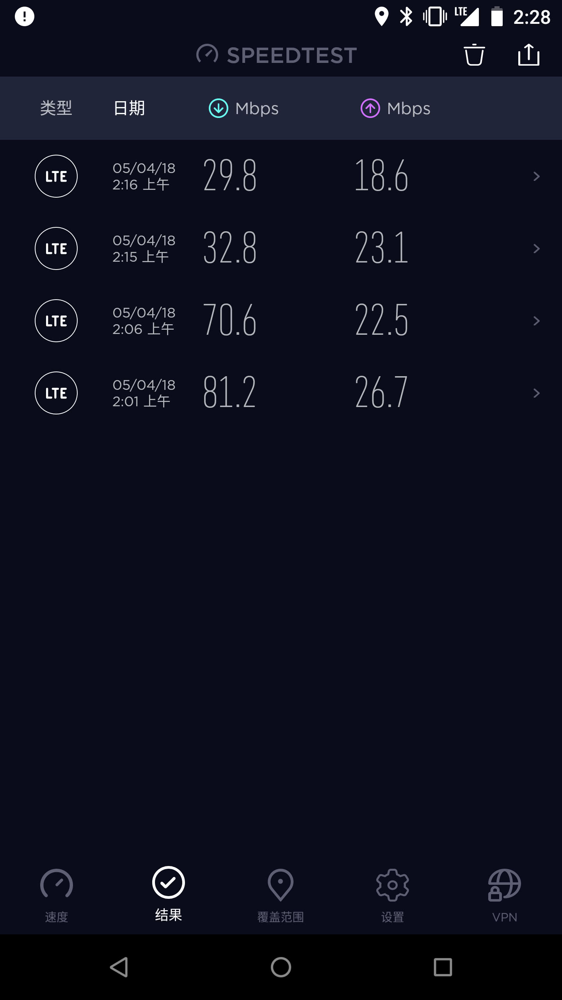

Da das WLAN in meiner Schule oft spinnt, habe ich mir kürzlich eine „Mi Fan Card“ SIM-Karte von China Unicom geholt.

Man sagt, dass China Unicom beim Zugriff auf Server im Ausland ziemlich schnell sein soll. Solange ich also noch die 40 GB High-Speed-Datenvolumen habe, wollte ich einen schnellen Vergleichstest mit meiner vorhandenen China Telecom-Karte machen.

Standort: Beijing

Test-Handy: Nexus 6 (mit freigeschaltetem Band 1)

China Telecom SIM - Vertragsregion: Hunan

China Unicom SIM - Vertragsregion: Peking

Proxy-Server: Selbst gehostetes Shadowsocks (mit aktiviertem TCP-BBR)

Testzeit: 2\:01 - 2\:16 Uhr

Speedtest China Unicom:

Internationaler Speedtest China Unicom:

Basisband-Infos während des Tests:

Speedtest China Telecom:

Internationaler Speedtest China Telecom:

Basisband-Infos während des Tests:

