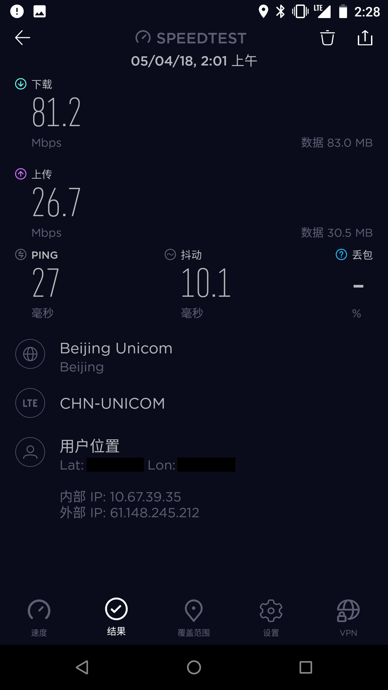
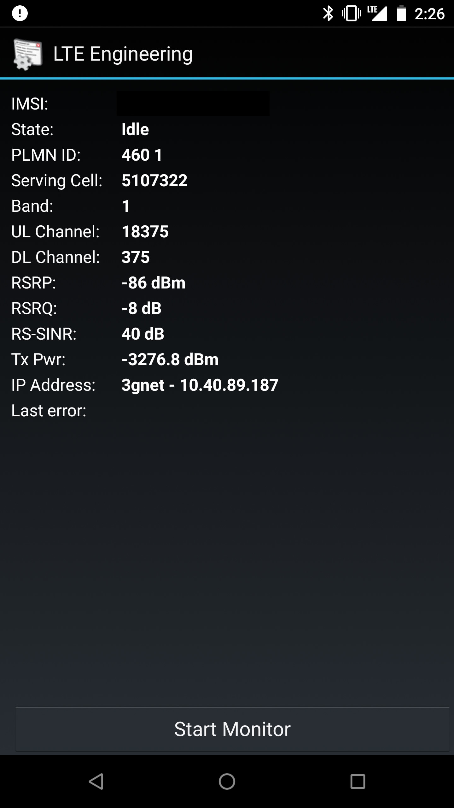
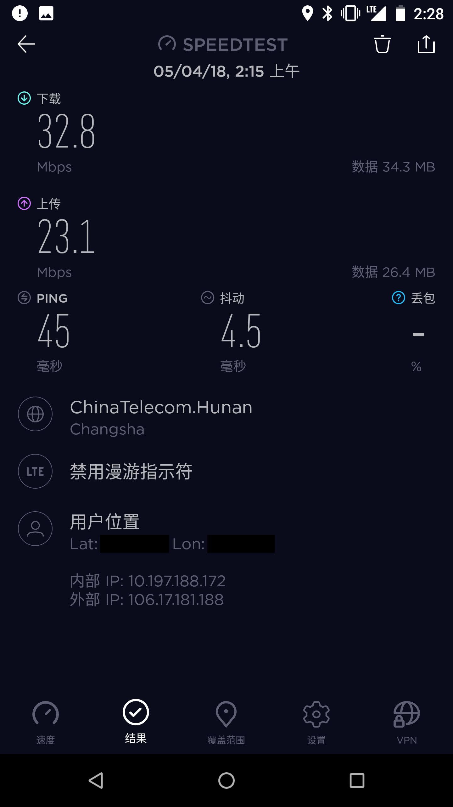
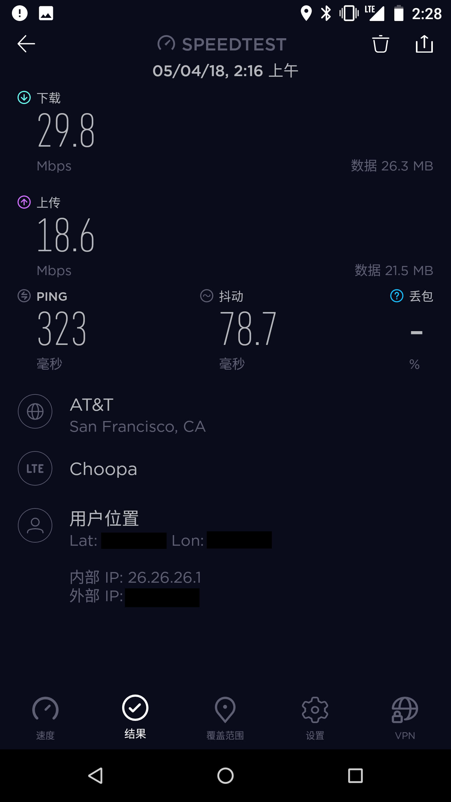
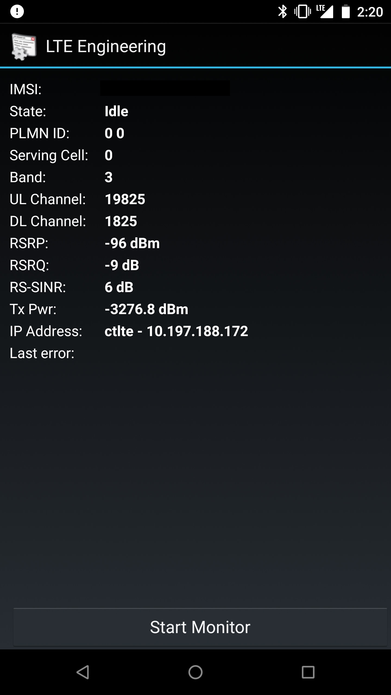

Since my school's Wi-Fi is often unreliable, I recently signed up for a China Unicom "Mi Fan Card" SIM.

I've heard that China Unicom offers fast speeds for connecting to overseas servers. So, while I still had the 40GB of high-speed data, I decided to run a quick comparison speed test against the China Telecom SIM card I already have.

Location: Beijing

Test Phone: Nexus 6 (with Band 1 unlocked)

China Telecom SIM - Home Region: Hunan

China Unicom SIM - Home Region: Beijing

Proxy Server: Self-hosted Shadowsocks (with TCP BBR enabled)

Test Time: 2\:01 - 2\:16 AM

China Unicom Speed Test:

China Unicom International Speed Test:

Baseband Info During Test:

China Telecom Speed Test:

China Telecom International Speed Test:

Baseband Info During Test:

