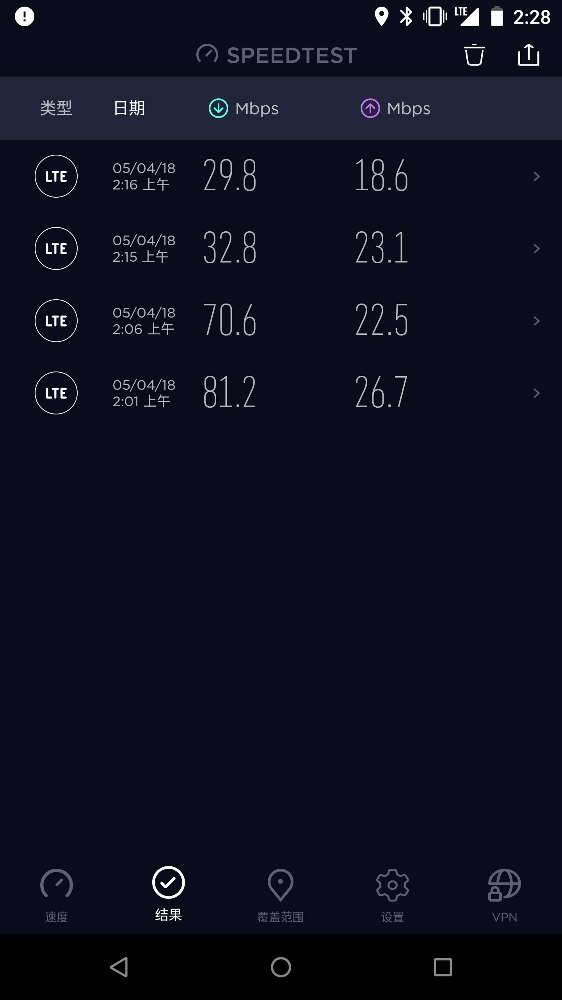
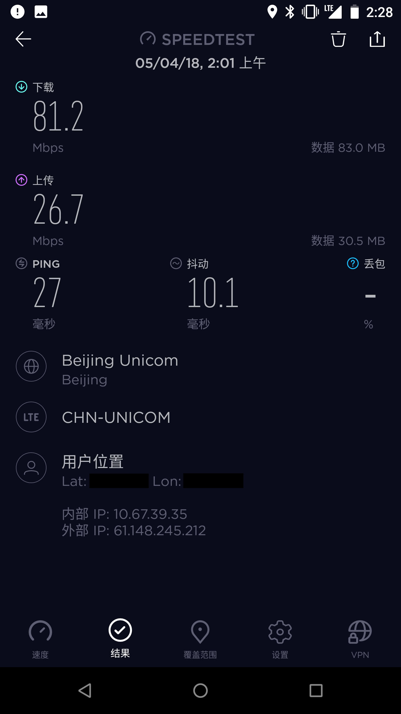
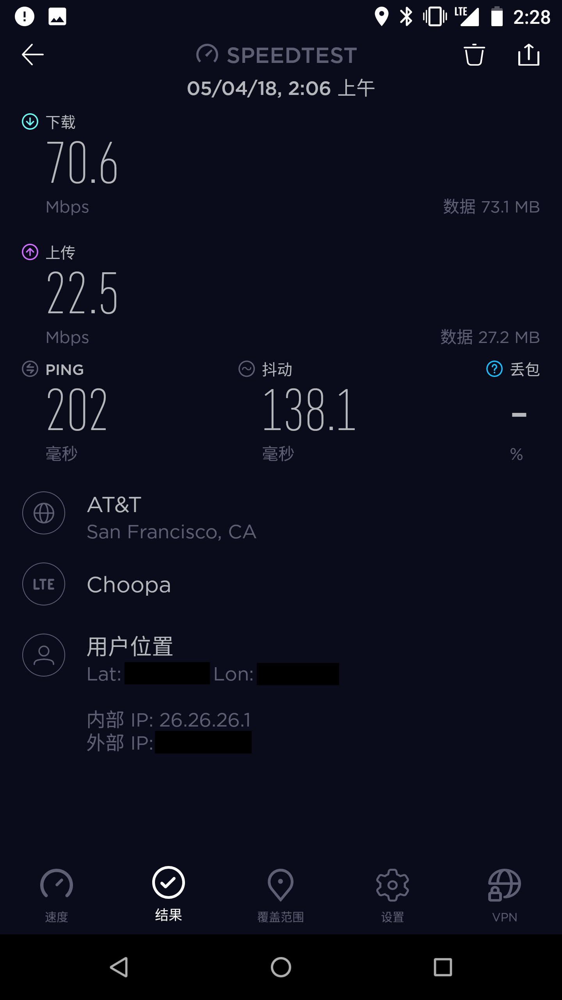
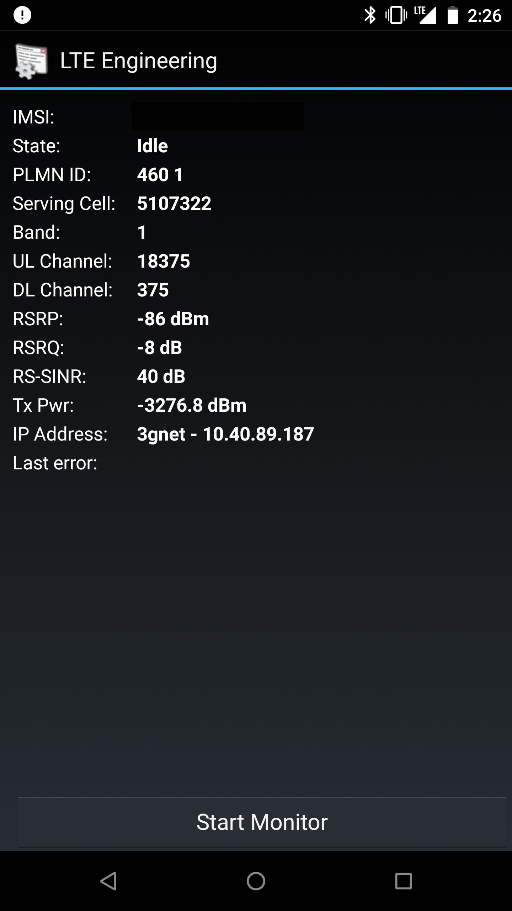
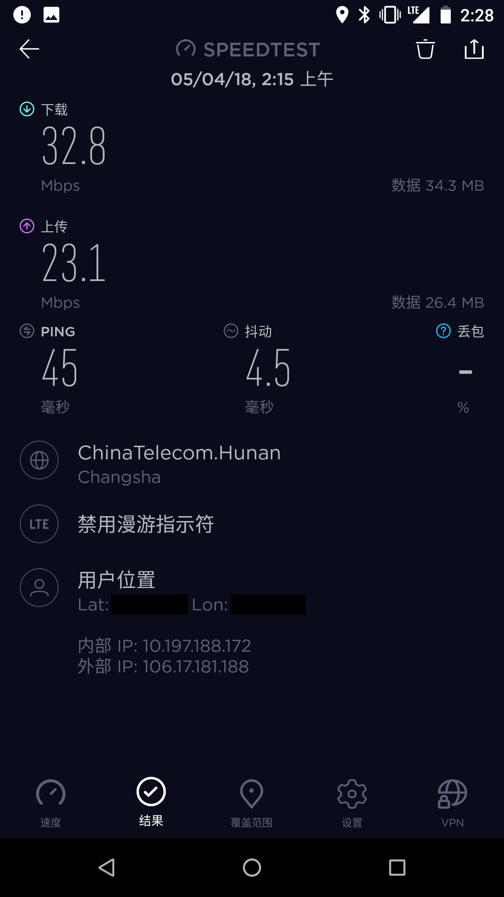
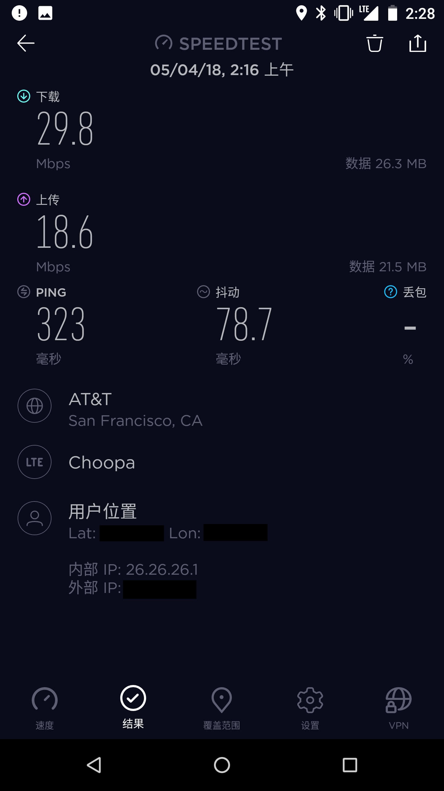
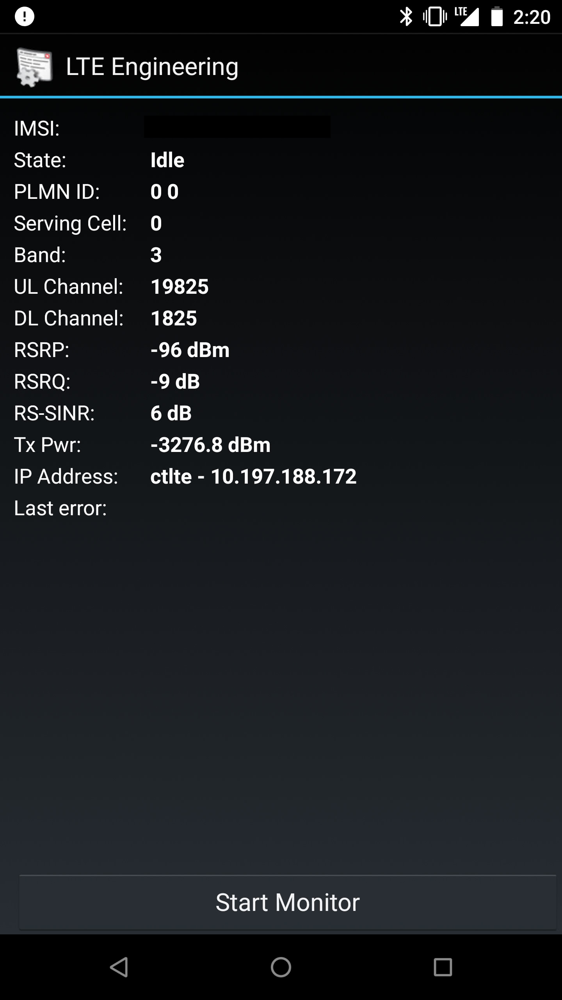

由于学校WiFi经常抽风，博主最近便申请了一张联通版的米粉卡。

据说联通访问国外服务器很快，博主就趁着40G的高速流量还在，赶紧跟手头上的电信卡做一个对比测速。

位置：北京

测试手机：Nexus 6（已破解Band1）

电信卡归属地：湖南

联通卡归属地：北京

代理服务器：自建SS（开启TCP-BBR）

测试时间：2\:01 - 2\:16

联通测速：

联通出国测速：

测速基带信息：

电信测速：

电信出国测速：

测速基带信息：

